# acfunlive-toolbox-client


## WHAT IS THIS?
This is a part of AcFun-livetoolbox project.


## Proj dir struct
- *src/electron_browser*: User interface code, vue code, code that running in electron as a webpage here.  
- *src/electron_nodejs*: Electron main process code, code that calling nodejs and electron directly, code that on the same layer as electron here.
- *src/tests/unit*: Code for unit-testing
- *src/tests/e2e*: Code for blackbox-testing

## Proj setup
```
npm install
```

### Compiles and hot-reloads for dev(without electron)
```
npm run serve
```

### Compiles and hot-reloads for dev(with electron)
```
npm run electron:serve
```

### Compiles for production
```
npm run electron:build
```
ps: build archive will put in dir *BUILD*.

### Run the unit tests
```
npm run test:unit
```

### Run the end-to-end tests
```
npm run test:e2e
```

### Lints and fixes files
```
npm run lint --fix
```

### Customize configuration
See [Configuration Reference](https://cli.vuejs.org/config/).
